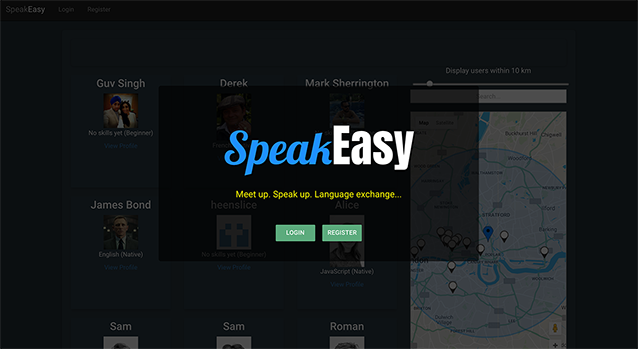
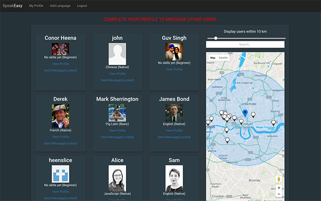
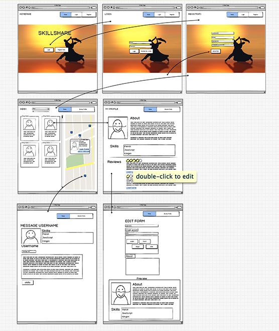

##GA WDI 25 London - Project 3

#SpeakEasy

The third project of the Web Development Immersive course was a group assignment with three other students. Our goal was to design and create a MEAN stack web application through successful team collaboration.

We were all inspired by the idea of a platform for users to meet each other and exchange skills. However, as all four of us are from different cultures, we later switched our focus to language exchange.

####The result is... SpeakEasy ([click to use app](https://speak-easy-app.herokuapp.com/)) 

###User Interaction

SpeakEasy provides a platform for users to find language exchange partners. A user must be willing to teach other users the language they speak in exchange for learning another. For example, a user speaks English and wants to practice speaking French. They can use SpeakEasy to look for a language exchange partner who speaks French and wants to improve their English.

Once logged in, users can search through other users by language, or filter users by distance on a map, then read a user's reviews and ratings before deciding to message that user. The message is sent directly to the recipient's email address.

*****Change image here*****

***

###Wire Framing

We stuck closely to the original wire frame planning.

***

###How it works:

* Users can register in the usual way or simply sign in using their GitHub or Facebook account.
* Logged-in users can view other users, either in a list or plotted on a map. 
* Users can be filtered by searching for specific languages.
* Users on the map can be filtered by distance from your current location using a radius circle.
* Users can read user reviews left by other users. These include a 1 to 5 star rating.
* Users can send a message to another user if they are interested in meeting for a language exchange. This message is then emailed to the recipient's personal email address.
* Messaging is locked by default. A user cannot message other users until they have fully completed their own profile.

* When you enter the website you will need to register to get access.
* Once registered you can view the current profiles and view users on a map.
* However to contact anyone you will need to register fully to unlock all the features.
* We used a ng-filter to dynamically update the page & map for whatever skill that you searched for.
* You can click on the profile picture of the user and see more details about the inidividual.
* We used node-mailer so you can send a message to the user which will go directly to their email address.
* You can also use the scroll bar to increase or decrease the distance between your current location and user profiles so you can quickly view who is the closest.
* Once you have met and exchanged a skill you can review the user by selecting a star rating and providing a short review.

####The build:

* For the project we used a full express RESTful app that includes token authentication.
* Used Node, Express, Ajax, JSON, JS, MongoDB, HTML 5, SASS and Angular were used to create the app.
* Used Google Map API to show users on the map, show the raduis and Geolocation when registering.
* Used NodeMailer to send emails to users.
* Used Amazon Web Services for storing images securely.
* Created directives for:
	* Google Autocomplete when users register their address
	* base64 encoding and decoding for images
	* Google Maps
		* showing the appropriate Markers using the Lat & Lng for each user registered.
		* showing the Google Map Info windows with the correct data.
		* showing the Google Map Circle Radius.
		* finding the distance between two points
* Used Satellizer to create token-based authentication for Facebook & GitHub.
* Used Angular Material for designing the forms.
* Used Angular features like:
	* 	ngFilter for searching and displaying the correct information.
	* 	ngMessages for the form validation and providing the user with responsive error messages.
	*  ngIf for user authentication on the front end to show & hide the messaging options.

##Problems & Challenges:

The first problem we encountered as a group was deciding who should build the API. Once we had decided on a project and developed a wireframed scope, we sat together and worked through building the fundamental part of the program on a big screen.

During the project we encountered many problems and as a team we dealt with all of them very efficently. Initially we did a group programming excercise where we developed the core product and reduced any GIT conflicts to a minimum. Once the core routes, controllers and the initial setup had been established we then listed out the other tasks via Trello and paired programmed the majority of them in two sub teams.

NodeMailer was an early challenge, and we implemented this successfully. The Google Maps API for the radius was also a good challenge and gave us the added functionality that we were thinking of. Another team member researched into Angular Material and provided the extra animation for all the forms for the app.

The main blocker was time, so many things needed attention so we used Trello to document the most important tasks for MVP knowing that we could add the extra functionality once that had been completed. I also managed the team to a large extent and I beleive that my organisational and excellent time management skills gave us the edge on this project.

TRELLO

###Future Improvements

I would like to make the following improvements to this app...

##If I had more time I would:

- To use more UI Bootstrap features eg Modals.
- Provide more user friendly notifications when a user sends a message to others.
- To have a separate map and profile listings page.
- To use realtime communications viia the app to each user using web sockets instead of offline email comms.
- Experiment with the color theme throughout the app.
- Make it fully responsive.
- Using RegEx to capitalising various outputs.
- We were thinking of having a video as our homepage but did not get time to find the right video.
- Styke email messages with our logo in the footer.
- Allow user to delete profile with confirmation modal.
- Show profile image in the top right when a user is logged in.
